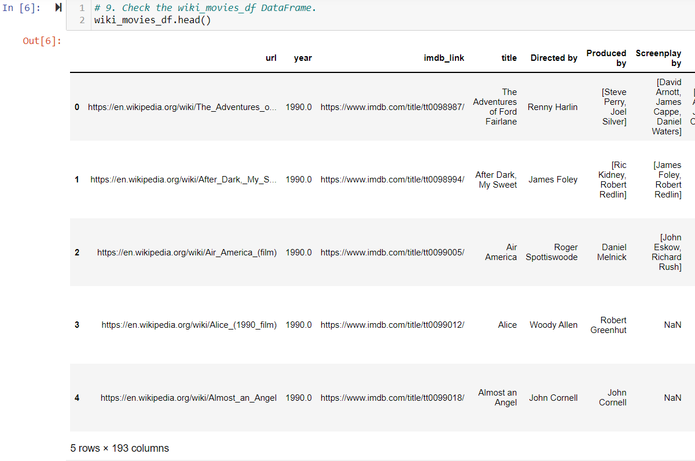
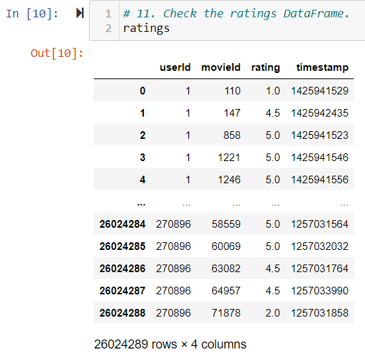
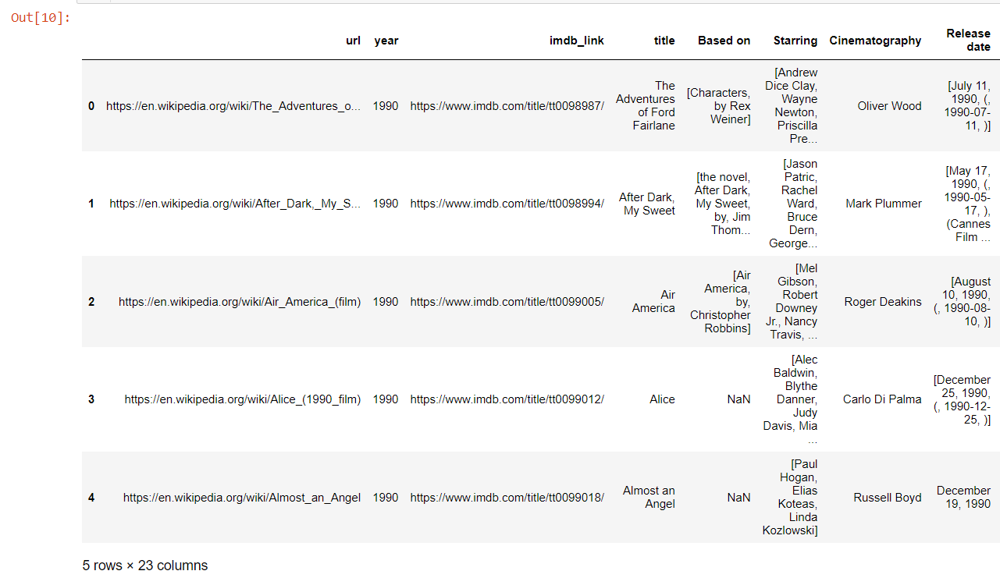
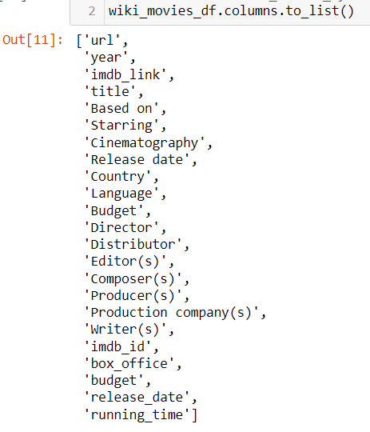

# Movies-ETL

Refactor code from this module to create one function that takes in the three files—Wikipedia data, Kaggle metadata, and the MovieLens rating data—and performs the ETL process by adding the data to a PostgreSQL database.

Deliverable 1 : Write an ETL Function to Read Three Data Files

wiki_movies_df

kaggle_metadata_df

ratings_df

Deliverable 2: Extract and Transform the Wikipedia Data

wiki_movies_df

wiki_movies_df List

